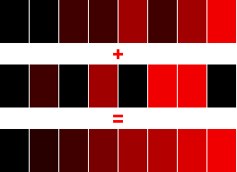

Multi Color Demo
================

A simple demo demonstrating different ways to display more than 4 colors on the Virtual Boy simultaneously.

**1. Dither**

OK, this is technically cheating since we do not really show more than 4 colors at once, but still, dithering creates a good *illusion* of a more color rich images, while not relying on any technical trickery.

**2. Column Table**

Through the Column Table's brightness repeat register, it is possible to change the amount of light emitted by the display LEDs (and thus the perceived brightness) every fourth pixel column. 

This allows for a huge range of different shades of red on screen at the same time, but practical use cases are very limited, since you're bound to the grid of 4px columns and brightness changes always affecting the whole screen height. 
 
**3. Blending**

This one exploits the laziness of the human eye to display 8 different colors on screen at the same time, by blending together two images. 

It works by overlaying one image with another, half transparent one. Half transparency is achieved by simply displaying that image only every second frame.

Beware that this trick does not work very well on emulators but produces pretty stable colors on real hardware. 

LICENSE
-------

Copyright (C) 2007, 2018 by Jorge Eremiev <jorgech3@gmail.com> and Christian Radke <chris@vr32.de>

This software is licensed under the MIT License, which means you can basically do with it whatever you
want as long as you include the original copyright and license notice in any copy of the software/source.

	Permission is hereby granted, free of charge, to any person obtaining a copy of this software and
	associated documentation files (the "Software"), to deal in the Software without restriction, including
	without limitation the rights to use, copy, modify, merge, publish, distribute, sublicense, and/or sell
	copies of the Software, and to permit persons to whom the Software is furnished to do so, subject to
	the following conditions:

	The above copyright notice and this permission notice shall be included in all copies or substantial
	portions of the Software.

	THE SOFTWARE IS PROVIDED "AS IS", WITHOUT WARRANTY OF ANY KIND, EXPRESS OR IMPLIED, INCLUDING BUT NOT
	LIMITED TO THE WARRANTIES OF MERCHANTABILITY, FITNESS FOR A PARTICULAR PURPOSE AND NONINFRINGEMENT. IN
	NO EVENT SHALL THE AUTHORS OR COPYRIGHT HOLDERS BE LIABLE FOR ANY CLAIM, DAMAGES OR OTHER LIABILITY,
	WHETHER IN AN ACTION OF CONTRACT, TORT OR OTHERWISE, ARISING FROM, OUT OF OR IN CONNECTION WITH THE
	SOFTWARE OR THE USE OR OTHER DEALINGS IN THE SOFTWARE.

CREDITS
-------

V810 is a trade mark of NEC. Virtual Boy is a trade mark of Nintendo.
Jorge Eremiev and Christian Radke are in no way affiliated with either of these parties.
